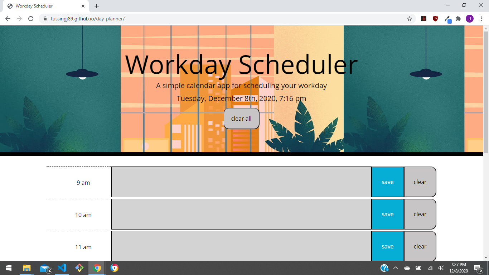

# day-planner
This project focuses on the use of jqeury. With jquery writing code is quick and easy, and makes for a simple easy to read document. With this day planner, scheduling your day becomes simple with color coded hours. It lets you see what needs to to be accomplished and when it should be done.
# no install, no wait

This file works on any webpage, so the viewing of this project is as simple as following the link listed below.
https://tussingj89.github.io/day-planner

# passwords made easy

Below is a sample of the code, with jquery the code is streamlined and easy to read. 

btn2.on("click", function() {
localStorage.setItem("entry2", time2pm.val());
});

btn3.on("click", function() {
localStorage.setItem("entry3", time3pm.val());
});

btn4.on("click", function() {
localStorage.setItem("entry4", time4pm.val());
});

btn5.on("click", function() {
localStorage.setItem("entry5", time5pm.val());
});

// getting storage
time9am.val(localStorage.getItem("entry9"));

time10am.val(localStorage.getItem("entry10"));

time11am.val(localStorage.getItem("entry11"));

time12pm.val(localStorage.getItem("entry12"))

# snapshot of the webpage

